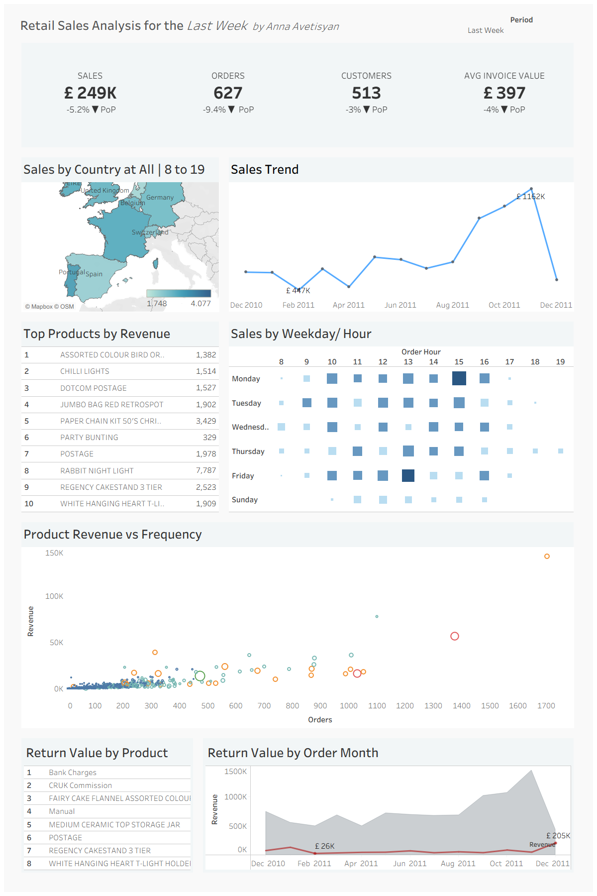
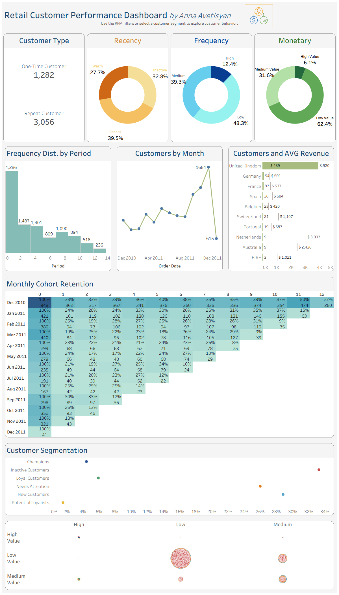

# Retail Sales & Customer Analytics

A Tableau analytics project focused on retail sales performance, customer behavior, segmentation, and retention analysis.

This project includes two connected Tableau dashboards built on the same retail dataset:

- **Sales Analysis Dashboard**
- **Customer Analysis Dashboard**

The goal is to analyze retail performance from both a business and customer perspective using interactive dashboards, calculated fields, parameters, and business-focused visual storytelling.

## Project Overview

This project explores key retail analytics questions such as:

- How is sales performance changing over time?
- Which products and countries generate the most revenue?
- How do customers behave across different time periods?
- Who are the most valuable customers?
- Which customer groups should be targeted for retention or marketing?
- How strong is customer retention over time?

## Dashboards

### Sales Analysis Dashboard

The sales dashboard focuses on overall retail business performance.
### Sales Analysis Dashboard

The sales dashboard focuses on overall retail business performance.



Main analysis areas:

- KPI overview
- Sales trend analysis
- Geographic sales analysis
- Product performance
- Sales by weekday and hour
- Period-over-period comparison

### Customer Analysis Dashboard

The customer dashboard focuses on customer behavior and customer value.



Main analysis areas:

- Customer KPI overview
- Customer growth trend
- Customer segmentation
- Revenue per customer
- Purchase frequency
- RFM analysis
- Cohort retention analysis

## Tools & Skills Used

- Tableau Desktop
- Tableau Public
- Calculated Fields
- Parameters
- Level of Detail Expressions
- Table Calculations
- Dashboard Actions
- KPI Design
- Customer Segmentation
- RFM Analysis
- Cohort Retention Analysis
- Business Dashboard Design

## Repository Structure

```text
retail-sales-customer-analytics/
│
├── dashboards/
│   ├── sales_analysis_dashboard.twbx
│   └── customer_analysis_dashboard.twbx
│
├── screenshots/
│   ├── sales_dashboard_overview.png
│   ├── customer_dashboard_overview.png
│   ├── rfm_analysis.png
│   └── cohort_retention.png
│
├── documentation/
│   ├── business_questions.md
│   ├── calculated_fields.md
│   ├── dashboard_design.md
│   └── project_notes.md
│
├── data/
│   └── README.md
│
└── README.md
```

This project is currently in progress.
The dashboards, screenshots, documentation, and final insights will be updated as the project is completed and polished.
